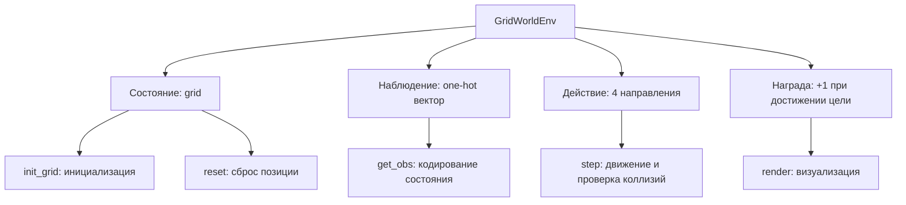

# Среда GridWorld

Документация среды `GridWorldEnv`, созданной на базе `gymnasium`.

## Общее описание

Среда представляет собой двумерное грид-пространство размером `h x w`, в котором агент (⭐) перемещается по клеткам-полу, избегая стен (⚫) и препятствий (🟥), с целью достичь цели (🟢).

!!! note "Векторизация"
    Эта среда не векторизована, однако была спроектирована с учётом потенциальной векторизации для использования с `VectorEnv`.

!!! warning "GPU и CUDA"
    CUDA не используется напрямую, но зависимости включают `torch` с поддержкой `cu124`. Убедитесь, что ваш GPU поддерживает CUDA 12.4.

!!! tip "Зависимости"
    Используйте `uv sync` для быстрой установки зависимостей, особенно с учётом специфичных индексов PyTorch.

## Диаграмма архитектуры



## Классы и функции

### `CellType`

Перечисление типов клеток на карте.

### `GridWorldEnv`

#### `__init__(self, h: int = 10, w: int = 10, ...)`

Инициализация среды.

**Args:**
    - `h` (int): Высота области без учёта границ-стен. По умолчанию 10.
    - `w` (int): Ширина области. По умолчанию 10.
    - `obstacle_mask` (np.ndarray | None): Булевая маска для препятствий. True = препятствие. Может быть транспонировано.
    - `n_colors` (int): Количество типов "пола" (разные цвета). Влияет на размер наблюдения.
    - `pos_goal` (tuple | np.ndarray): Позиция цели. Должна быть достижима.
    - `pos_agent` (tuple | np.ndarray): Начальная позиция агента. Может быть списком вероятностей.
    - `see_obstacle` (bool): Может ли агент "видеть" препятствия при столкновении. Если да — возвращает наблюдение за ними.
    - `render_mode` (str | None): Режим отрисовки: "human" или "rgb_array".

**Attributes:**
    - `feature_wall`, `feature_obstacle`, `feature_goal` (int): Константные значения для кодирования типа клетки в `grid`.
    - `grid` (np.ndarray): Внутреннее представление мира (h+2, w+2) со стенами по периметру.
    - `action_space`: Дискретное пространство из 4 действий.
    - `observation_space`: Вектор one-hot кодировки типа клетки под агентом. Размер = `n_colors + 3`.

**Пример:**

```python
env = GridWorldEnv(h=8, w=8, n_colors=3, pos_goal=(7, 7))
```

#### `_init_grid(self, seed: int | None)`

Инициализирует внутренний `grid`.

1. Заполняет всё стенами (`feature_wall`).
2. Внутренний прямоугольник (без стен) заполняется случайным полом и препятствиями.
3. Устанавливает цель.

!!! example "Формула начальной инициализации"
    $$
    \text{grid}_{i,j} =
    \begin{cases}
    \text{feature\_wall}, & \text{если } i=0 \vee i=h+1 \vee j=0 \vee j=w+1 \\
    \text{feature\_obstacle}, & \text{если } \text{obstacle\_mask}_{i-1,j-1} = \text{True} \\
    \text{случайный цвет пола}, & \text{иначе}
    \end{cases}
    $$

#### `_get_obs(self) -> np.ndarray`

Генерирует наблюдение — one-hot вектор.

**Returns:**
    - `np.ndarray`: Вектор формы `(n_colors + 3,)`, где единица стоит на позиции, соответствующей типу клетки, "видимой" агентом (`see_pos`).

#### `reset(self, seed=None, options=None) -> tuple`

Сбрасывает состояние среды.

1. Вызывает `super().reset(seed=seed)`.
2. Инициализирует сетку через `_init_grid`.
3. Устанавливает позицию агента:
   - Если `pos_agent` — кортеж, устанавливается напрямую.
   - Если `pos_agent` — массив вероятностей, выбирается случайно с учётом маски.

**Returns:**
    - Наблюдение и пустой словарь (совместимо с Gymnasium).

#### `step(self, action: int) -> tuple`

Выполняет одно действие.

1. Вычисляет новую позицию.
2. Проверяет, можно ли туда двигаться (стена/препятствие).
3. Обновляет состояние и `see_pos`.
4. Награда +1 и `terminated=True`, если достиг цели.

**Args:**
    - `action` (int): 0=вверх, 1=вправо, 2=вниз, 3=влево.

**Returns:**
    - Наблюдение, награда, флаг завершения, False (truncated), info.

!!! example "Логика шага"
    ```python
    v = [[-1,0], [0,1], [1,0], [0,-1]]  # векторы движения
    target = agent_pos + v[action]
    if grid[target] in [feature_wall, feature_obstacle]:
        see_pos = target if see_obstacle else agent_pos  # видит препятствие или нет
        reward = 0
    else:
        agent_pos = target
        see_pos = target
        if grid[target] == feature_goal:
            reward = 1
            done = True
    ```

#### `render(self)` и `render_map(self)`

Отрисовывают текущее состояние с помощью `matplotlib`.

- Используется `Set3` палитра для полов.
- Добавлены легенда и сетка.
- В режиме "human" показывается интерактивное окно.

## Примеры использования

### Базовый запуск

```python
import gymnasium as gym
from rl_grid_world.envs.grid_world import GridWorldEnv

env = GridWorldEnv(h=6, w=6, n_colors=2, pos_goal=(5, 5))

obs, info = env.reset(seed=42)

for _ in range(20):
    action = env.action_space.sample()  # случайное действие
    obs, reward, terminated, truncated, info = env.step(action)
    if terminated or truncated:
        obs, info = env.reset()
    env.render()

env.close()
```

### Начальная позиция по распределению

```python
# Задаём вероятности старта
start_probs = np.zeros((6, 6))
start_probs[1:3, 1:3] = 1  # старт в верхнем-левом углу
start_probs /= start_probs.sum()

env = GridWorldEnv(pos_agent=start_probs, obstacle_mask=(start_probs == 0))
```
