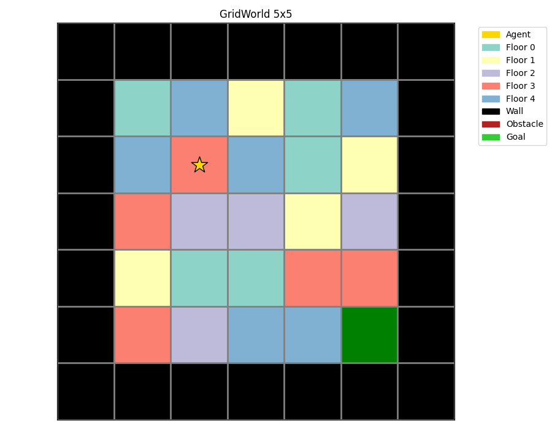
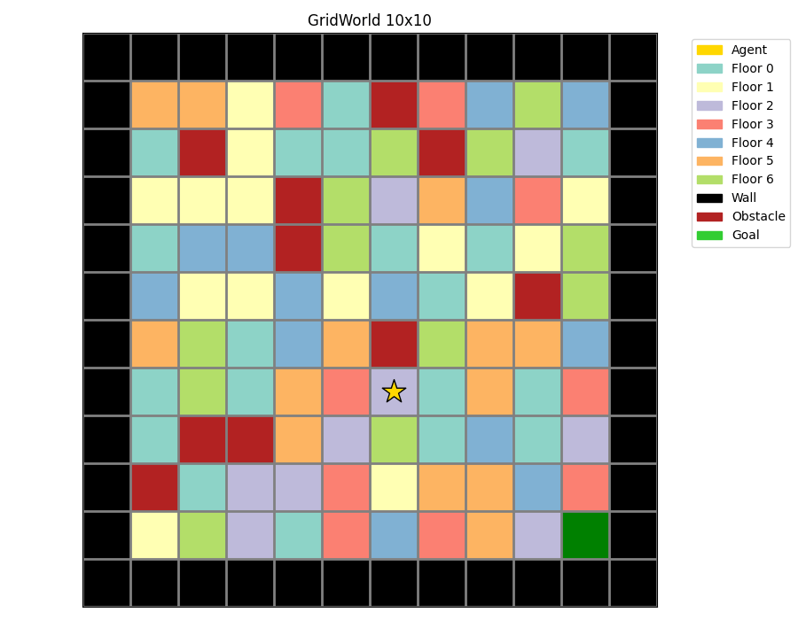

# Результаты

На этой странице собраны ключевые результаты обучения агентов
в среде GridWorld. Каждый анимационный график сопровождается
кратким описанием.

## DRQN на 5×5 GridWorld с частичной наблюдаемостью

Результат обучения для поля 5*5 с 5 цветами, без препятствий

## DRQN на 5×5 GridWorld с частичной наблюдаемостью

Результат обучения для поля 5*5 с 25 цветами, без препятствий

## DRQN на 10×10 GridWorld с частичной наблюдаемостью

Результат обучения для поля 10*10 с 7 цветами, 10 %  препятствий
